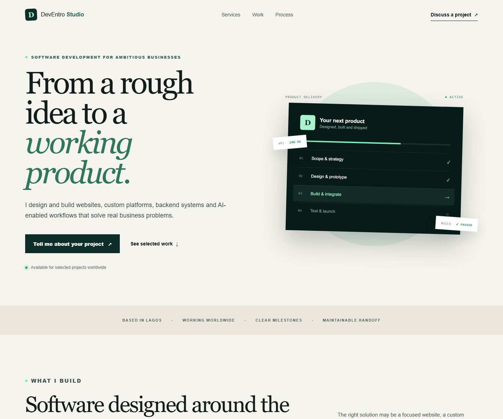

# DevEntro Studio

A responsive software-development portfolio and lead-generation site for DevEntro Studio, the software development brand of Aliameen Fatunbi.

Live site: <https://dev.deventro.site>



## Overview

DevEntro Studio presents services, selected work, technical capabilities and a contact flow for potential clients. It is built as a static Next.js site and deployed on Cloudflare Pages.

## Tech stack

- Next.js 16
- React 19
- TypeScript
- CSS
- Cloudflare Pages static hosting

## Features

- Responsive landing page for desktop and mobile
- Services, selected work, process and capability sections
- Static export configured with `output: "export"`
- Custom favicon in `public/favicon.svg`
- Email-based contact calls to action
- Preview screenshot captured from the live deployment

## Run locally

Requirements: Node.js 22.13 or newer.

```bash
npm install
npm run dev
```

Open <http://localhost:3000>.

## Production build

```bash
npm run build
```

The static export is generated in `out/`.

## Deployment

This project is deployed to Cloudflare Pages at:

<https://dev.deventro.site>

Cloudflare Pages settings:

- Production branch: `main`
- Build command: `npm run build`
- Build output directory: `out`
- Framework preset: `Next.js (Static HTML Export)`
- Custom domain: `dev.deventro.site`

## Project structure

```text
app/
  globals.css      Global styles and responsive layout
  layout.tsx       Page metadata and root layout
  page.tsx         Landing page content and sections
public/
  deventro-studio-home.png   README preview screenshot
  favicon.svg                Site favicon
next.config.ts     Static export configuration
package.json       Scripts, dependencies and Node engine
tsconfig.json      TypeScript configuration
```

## Customize

- Main copy, services, projects and links: `app/page.tsx`
- Colors, spacing and responsive behavior: `app/globals.css`
- Page title and meta description: `app/layout.tsx`
- Static export settings: `next.config.ts`
- README preview image: `public/deventro-studio-home.png`

The contact buttons currently open an email to `adebukolaolamilekan123@gmail.com`. Update the `mailto:` links in `app/page.tsx` when the business email changes.
